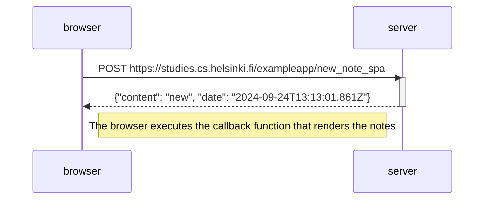

```mermaid
sequenceDiagram
    participant browser
    participant server

    browser->>server: POST https://studies.cs.helsinki.fi/exampleapp/new_note_spa
    activate server
    server-->>browser: {"content": "new", "date": "2024-09-24T13:13:01.861Z"}
    deactivate server

    Note right of browser: The browser executes the callback function that renders the notes
```
